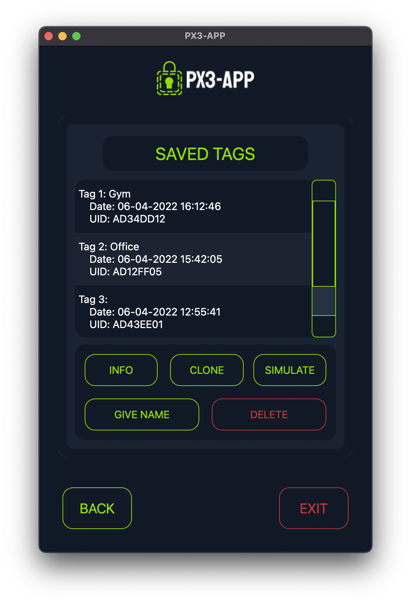
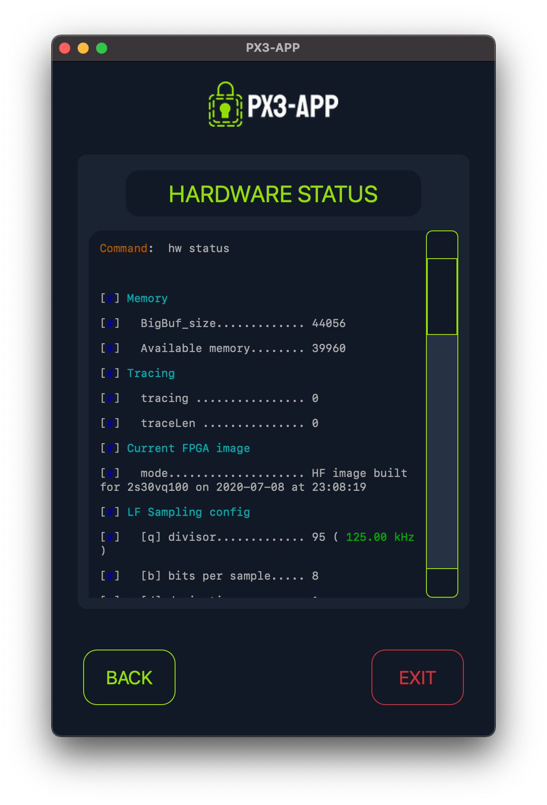

# 

A cross-platform GUI for the [Proxmark3](https://github.com/RfidResearchGroup/proxmark3).

## Functionalities

- Basic functionalities:
  - Hardware status
  - Automatic tag identification
  - Low and High Frequency tag identification
- Mifare Classic:
  - Read and save tag information
  - Give name to saved tags
  - Tag cloning
  - Tag simulation
- Custom Proxmark Client commands

## Screenshots

|  |  |
|------------------------------------------------------------------|----------------------------------------------------------|

## Installation

1. Install the [proxmark3](https://github.com/RfidResearchGroup/proxmark3) Client on your system.
2. Clone this repository:
   ```bash
   git clone https://github.com/javimarting/px3-app
   cd px3-app
   ```
3. Install the necessary dependencies:
   ```bash
    pip install -r requirements.txt
    ```


    