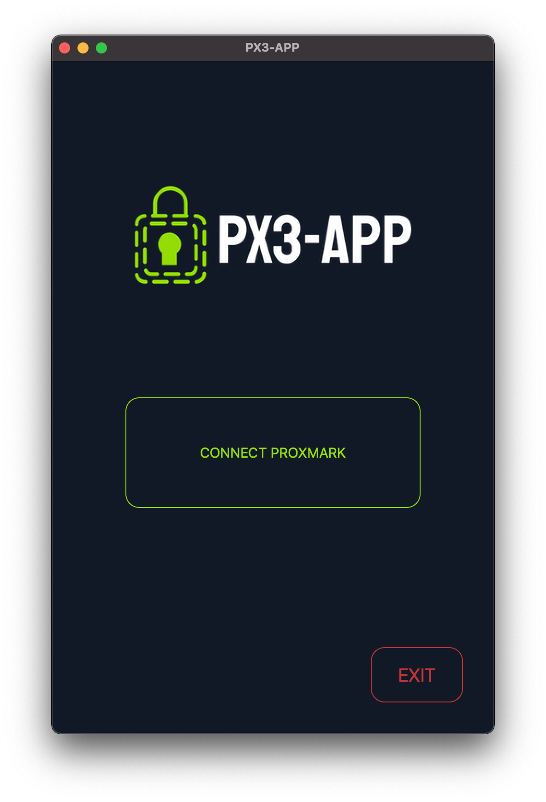

# 

A cross-platform GUI for the [Proxmark3](https://github.com/RfidResearchGroup/proxmark3) client.

## Functionalities

- Basic functionalities:
  - Automatic tag identification
  - Low and high frequency tag identification
- Mifare Classic:
  - Read and save tag information
  - Tag cloning
  - Tag simulation
- Custom commands

## Screenshots

|  |  |
|---------------------------------------------------------------------|----------------------------------------------------------|

## Installation

1. Install the [proxmark3](https://github.com/RfidResearchGroup/proxmark3) client on your system.
2. Clone this repository:
   ```bash
   git clone https://github.com/javimarting/px3-app
   cd px3-app
   ```
3. Install the necessary dependencies:
   ```bash
    pip install -r requirements.txt
    ```


    