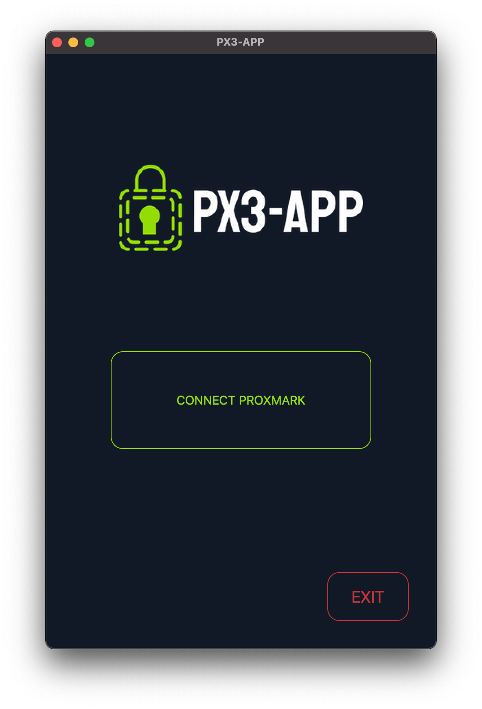
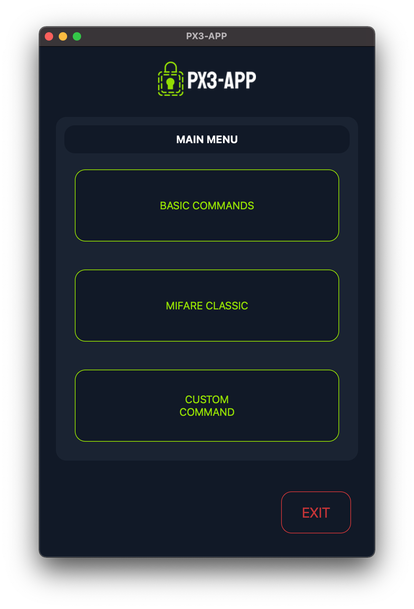
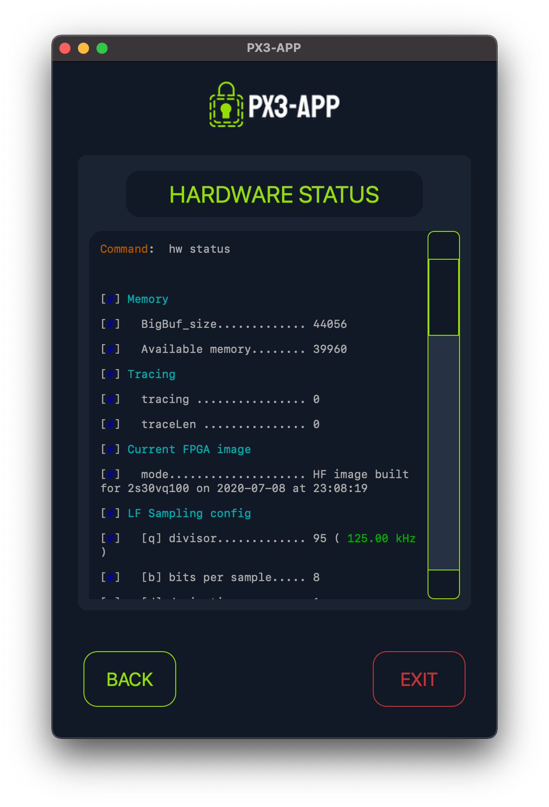

# PX3-APP

A cross-platform GUI for the [proxmark3](https://github.com/RfidResearchGroup/proxmark3) client.

|  |                                               |
| --- |-----------------------------------------------|
 |  |  |
|  |  |

## Installation

1. Install the [proxmark3](https://github.com/RfidResearchGroup/proxmark3) client on your system.
2. Clone the repository:
   ```bash
   git clone https://github.com/javimarting/px3-app
   cd px3-app
   ```
3. Install the necessary dependencies:
   ```bash
    pip install -r requirements.txt
    ```
    